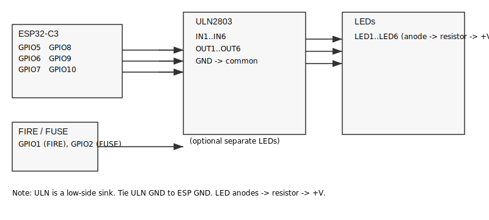

# Red-gobbo

Small PlatformIO firmware project skeleton for the "Red-gobbo" embedded device.

## Overview
This is a custom ESP32 setup to support the build of the Red-Gobbo 2023 model and introduce lighting to it.

## Features
- PlatformIO build system and environment examples
- Flash / monitor commands
- Basic wiring and configuration notes
- Contributing and license template

## Prerequisites
- PlatformIO IDE or PlatformIO Core (CLI)
- USB cable and compatible development board
- Relevant toolchain installed by PlatformIO

## Example platformio.ini
Replace the environment with the board you actually use.

```ini
[platformio]
default_envs = esp32dev

[env:esp32dev]
platform = espressif32
board = esp32dev
framework = arduino
monitor_speed = 115200
build_flags =
    ; adjust defines here
    -D DEBUG
lib_deps =
    ; list dependencies here, e.g. some-library/1.2.3
```

## Quick commands
- Build: pio run
- Build + upload: pio run -t upload
- Clean: pio run -t clean
- Serial monitor: pio device monitor (or pio device monitor -b 115200)

## Flashing steps
1. Connect board via USB.
2. Select the correct env in `platformio.ini` or use `-e <env>`.
3. Run `pio run -t upload`. If manual boot mode is required, follow your board's reset/boot sequence.

## Serial output
Use the serial monitor to view logs:
- Default baud: 115200 (change `monitor_speed` in platformio.ini)
- Example: pio device monitor --port COM3 --baud 115200

## Wiring (example)
- Power: 5V or 3.3V depending on board
- GND: common ground

### Wiring diagram

ASCII (quick reference):
```
ESP32-C3 GPIOs --> ULN2803 IN1..IN6 --> ULN2803 OUT1..OUT6 --> LED cathodes
LED anodes -> resistor (220-330Ω) -> +V

Example mapping (default in this project):
    GPIO5  -> IN1 -> OUT1 -> LED1
    GPIO6  -> IN2 -> OUT2 -> LED2
    GPIO7  -> IN3 -> OUT3 -> LED3
    GPIO8  -> IN4 -> OUT4 -> LED4
    GPIO9  -> IN5 -> OUT5 -> LED5
    GPIO10 -> IN6 -> OUT6 -> LED6

FIRE and FUSE LEDs are driven from LEDC (hardware PWM): GPIO1 (FIRE), GPIO2 (FUSE).
```

Graphical diagram (recommended):



Notes:
- ULN2803 is a low-side driver: connect each LED cathode to the corresponding ULN OUTx.
  The LED anode goes to +V through a suitable resistor (220-330Ω typical).

- Tie ULN GND to ESP32 GND. The ULN COM pin is only required for inductive loads; for LEDs it can usually be
  left unconnected.

- Ensure a common ground between ESP32 and the LED supply. If LEDs use a higher voltage than the ESP's Vcc,
  supply that voltage to the LED anodes and keep ULN ground common.

Example (physical signal flow for LED1):

    +V --- resistor ---+--> LED anode
                        |
                      LED cathode
                        |
                    ULN OUT1 -> ULN GND -> common GND

## Red-gobbo: lighting effects (ESP32-C3 + ULN2803)

This project contains firmware to drive a small set of LEDs using an ESP32-C3 and a ULN2803
Darlington sink driver. The lighting code was refactored into a small library `lib/LightEffects` so
`src/main.cpp` stays compact.

Key behaviours:
- Three Christmas strand modes (run in sequence):
    - Chain (stepped chase with per-LED triangular fade)
    - Twinkle (random short triangular twinkles, capped to 3 simultaneous)
    - Group fade (A/B groups fade in/out alternately)
- Smooth transition between modes: fade-to-baseline, short hold, then off before the next mode
- FIRE and FUSE single-LED effects remain in `src/main.cpp` using LEDC hardware PWM.
  This reduces CPU usage and provides smoother flicker for those two LEDs.

Pin mapping (default in `src/main.cpp`):
- CHRISTMAS_PINS: {5, 6, 7, 8, 9, 10} — pass these to `LightEffects` constructor in this order (index 0..5)
- FIRE_PIN: 1 (LEDC channel 0)
- FUSE_PIN: 2 (LEDC channel 1)

Library API (lib/LightEffects)
- LightEffects(const int pins[6]) — constructor; pins must be a 6-element array with the GPIO numbers
  for the ULN2803 inputs.
- void begin() — initialize pins and start the ISR-driven software PWM.
- void tick() — non-blocking call; call frequently from `loop()` to run the sequencer and effects.
- void setModeDuration(unsigned long ms) — optional runtime override for how long each Christmas mode runs
  (default 15000 ms).

Behavioural notes and defaults
- Twinkle cap: at most 3 simultaneous twinkles are allowed to avoid busy visuals.
- Twinkle evaluation interval: randomized between 250–400 ms to make starts feel organic.
- Software PWM: the 6 Christmas outputs use an ISR-driven software PWM (64-step) to avoid exhausting LEDC
  channels and keep FIRE/FUSE on LEDC.
- Mode duration default: 15 seconds (adjust with `setModeDuration()` if you prefer longer/shorter cycles).
- Transition fade: 800 ms fade-to-baseline, 200 ms hold before switching modes.

Build & run (PlatformIO)
1. Build: `pio run` or `pio run -e <your-env>` (example uses `esp32-c3-devkitm-1`)
2. Upload: `pio run -t upload -e <your-env>`
3. Monitor serial: `pio device monitor -e <your-env>` or `pio device monitor --port COM3 -b 115200`

Suggested next steps
- If you want a runtime UI to change mode duration or force a mode, I can add a simple serial command parser
  (tiny menu) or expose a button input to cycle modes.
- Add `lib/LightEffects/README` documenting the public API and example usage (I can add this in a follow-up).


## Configuration
- Put device-specific settings in a config header or use `build_flags` to inject macros.
- Keep secrets out of the repository; use environment variables or a local file ignored by git.

## Troubleshooting
- Build failures: run `pio run -v` for verbose output.
- Upload issues: check port (`pio device list`) and cable, try manual reset.
- Dependency issues: clear `~/.platformio` or run `pio update`.

## Contributing
- Open issues for bugs or feature requests.
- Use branches and make small, focused pull requests.
- Include a short changelog for non-trivial changes.

## License
Proprietary — All rights reserved. This repository is not published under an open-source license.
Contact the project owner for licensing terms.
